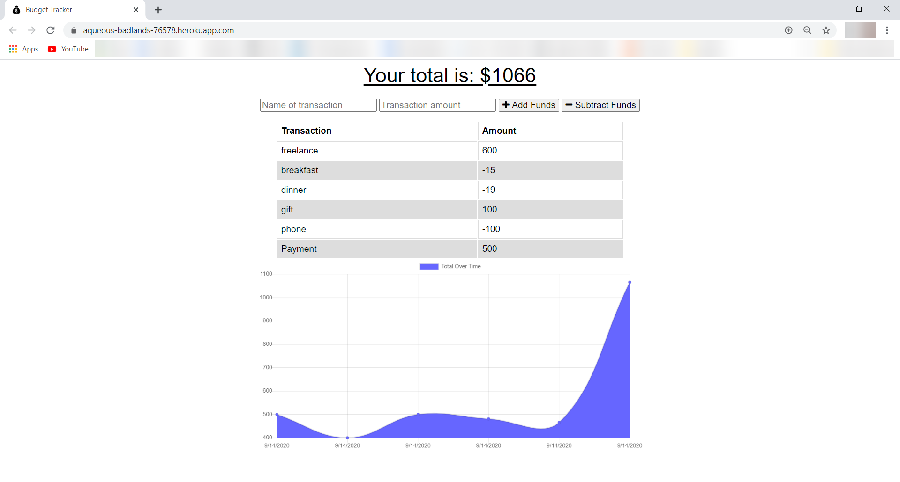
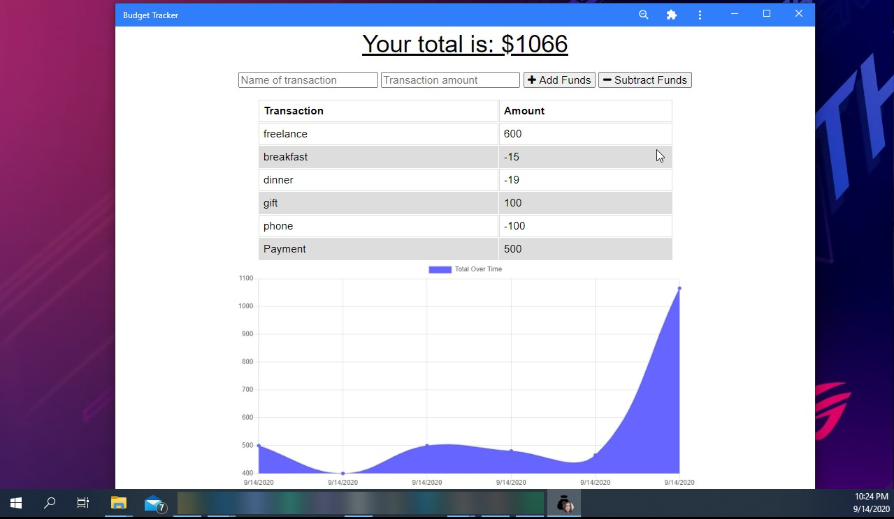
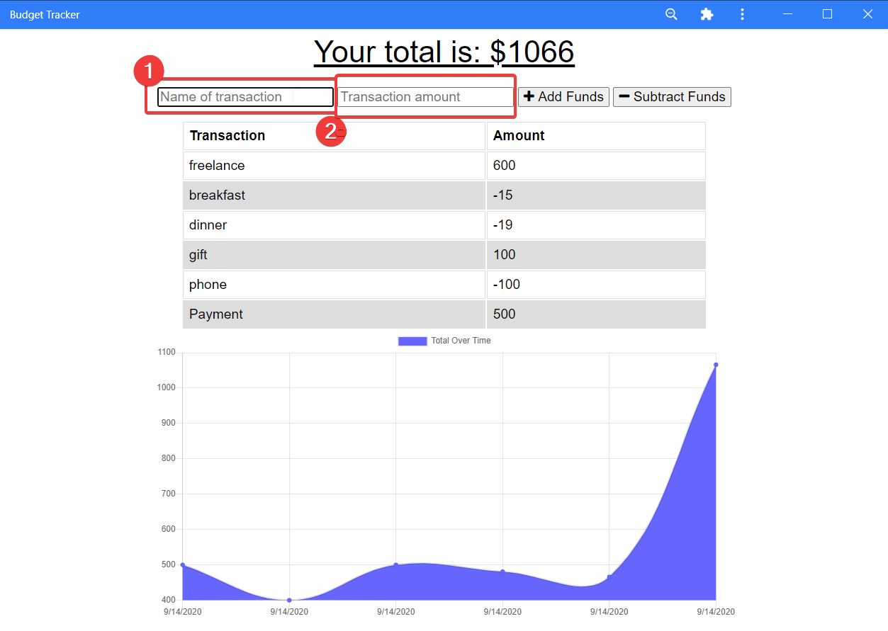
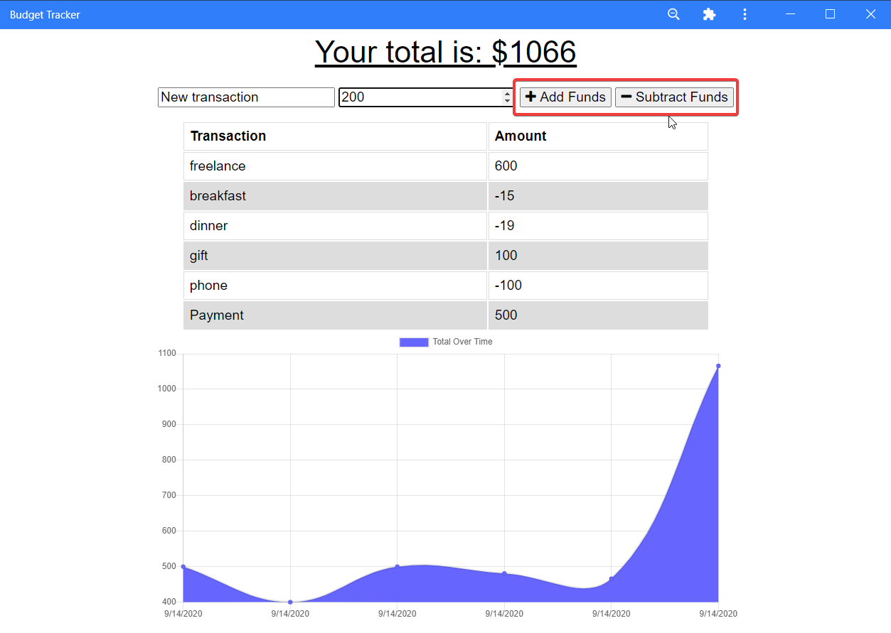
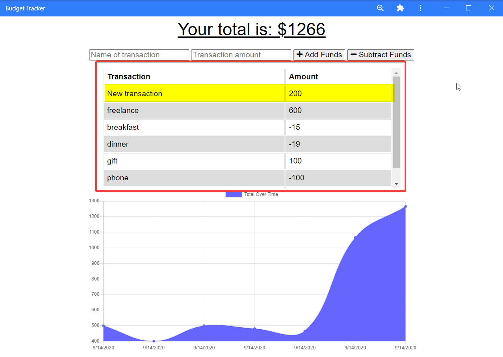

# Tracking Budget  

  ## Description 

    An PWA web app to track your withdrawals and deposits with or without a data/internet connection.

 

  ## Table of Contents 
  * [Installation](#installation)
  * [Usage](#usage)
  * [License](#license)
  * [Contributing](#contributing)
  * [Questions](#questions)
  
  ## Installation

    1. On your computer or phone, open Chrome.

    2. Go to the link of the app:

https://aqueous-badlands-76578.herokuapp.com/

    3. At the top right of the address bar, click Install ➕.

    4. Follow the onscreen instructions to install the PWA.

    5. And this is how it will appear:

 

  ## Usage

  1. To add a new transaction: type the "Name of transaction" and the "Transaction amount":

   

  2. Click on the buttons [➕ add Funds] or [- Subtract Funds] depending on the type of transaction to do:

   

  3. And then it will show up on the transaction history section:

   
  

  ## License

    Copyright © 2020 florhaidee. 
    Licensed under the MIT to see more about this license you can find it on the file 'license.txt' go to [MIT-license](LICENSE) 

  ## Contributing 

    Please note that this project is released with a Contributor Code of Conduct. By participating in this project you agree to abide by its terms.
    Visit:
https://www.contributor-covenant.org/version/2/0/code_of_conduct/ to have more information.

    To contribute 
     * Add an issue
     * Create a new branch with format-name: 
        - (feature/name/your-name) or (bug/name/your-name) 
     * Make a pull request.

  ## Questions

    If you have more questions about this application, you can contact me by:
      email: florhaideedev@gmail.com
      GitHub username: florhaidee

  ## ©️2020  Made with ❤️ by florhaidee
